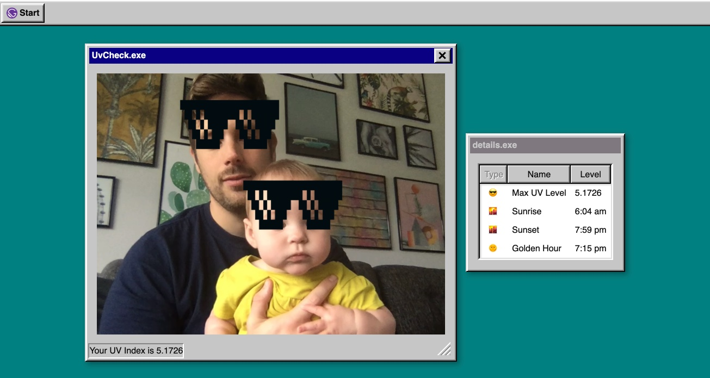

# Gatsby FuncJam '21
## Do I need my sunglasses?
Use your webcam and location to decide if you need your sunglasses today.

## Installation

`npm install`

- Generate api key at [Open UV](https://www.openuv.io/).
- Add `API_KEY` environment variable. (if no API key is added mock data is used).
- Camera and location is required.

## Demo
[sunglasses.gatsbyjs.io](https://sunglasses.gatsbyjs.io/)

### Custom Error screen

## Submission Checklist

- [x] Add installation documentation to the README
- [x] Update the `/api` folder with your function
- [x] Submit your theme at https://gatsbyjs.com/func-jam-21/

## Helpful Links

Read the Gatsby [functions docs](https://www.gatsbyjs.com/docs/reference/functions/).
Check out this video all about Gatsby functions 
Take a look at the Functions Use Cases over [here](https://www.gatsbyjs.com/products/cloud/functions/). 
